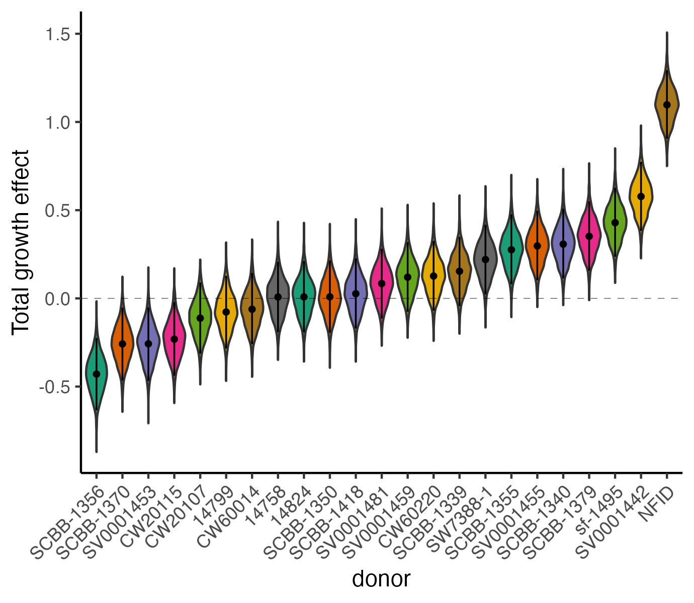

# Townlet 

<table>
<tr>
<td width="140px">
  
</td>
<td>
  Hierarchical Dirichlet regression model for infering statistically significant treatment specific donor and group (e.g. sex, ancestry, genetics) proliferation effects from cell village compositional data.
</td>
</tr>
</table>

<br><br>

## Installation

### Option 1: 
Townlet uses [rstan](https://mc-stan.org/rstan/) to run inference. Please ensure that rstan is properly installed before installing townlet. 

Townlet was built with the following dependencies. 

```yaml
name: townlet
channels:
  - conda-forge
  - defaults
dependencies:
  - r-base=4.4.2
  - r-rstan=2.32.6
  - r-data.table=1.17.0
  - r-dplyr=1.1.4
  - r-ggh4x=0.3.0
  - r-stringr=1.5.1
  - r-tidyr=1.3.1
  - r-remotes=2.5.0
```

### Option 2 (recommended): 

Step 1: Install [Docker](https://www.docker.com/products/docker-desktop/)
<br><br>
Step 2: Move to working directory and pull docker image.
```
cd path/to/working/dirctory
# Docker image coming soon!
```
Step 3: Initiate docker session by running the following command
```
docker run -it -p 8787:8787 \
  -v "$(pwd)":/home/rstudio/project \
  townlet-rstudio
```

Then open following host link in browser (http://localhost:8787). Enter username = rstudio and the password provided by running command above. 

Step 4: Test Townlet installation by running

```R
setwd('./project')
library(townlet)
test_townlet()
```

This will run Townlet on a simulated data set and will save fitted model and results/diagnostic plots in your working directory. 

Step 5: Run Townlet on your own village composition data 

Note- if you are working in a docker virtual environment it can only see files and subdirectories in the location where you launched from. Make sure your village composition data is in the directory where you launch docker from and your filepath variables in all function calls are relative to your docker virtual environment filepath! See tutorial below for how to format data, run townlet and interpret results. 

## Submit a bug report

Submit a bug report here on GitHub as an issue or send an email to [hansonc@g.ucla.edu](hansonc@g.ucla.edu). 

<br><br>

## Cite townlet

Please cite the following preprint if you use townlet:

[Cell villages and Dirichlet modeling map human cell fitness genetics](https://www.biorxiv.org/content/10.1101/2025.09.26.678880v1)

<br><br>

## Townlet tutorial

Once townlet is installed and the environment activated individual donor proliferation and group wise effects can be infered by calling two functions. 

<br>

### Step 1: Initiate village object 

The following function must be be run first to check that the data is in the correct format based on the user specified model. Townlet uses a generalized linear model framework to estimate donor proliferation effects relative to a baseline donor.


```{r}
library(townlet)

# Initiate village object
village <- init_village(datapath,              # composition data filepath (.csv)
                        outdir= './',          # output directory
                        name='test_townlet',   # File name prefix 
                        model=NULL,            # Define linear model
                        alldonors=TRUE,        # Include all original donors
                        normalize=FALSE,       # Compositional data must sum to 1. If removing a donor set to normalize=TRUE to renormalize. 
                        cls=NULL,              # Colors to use for each donor
                        T0_cutoff=NULL,        # Remove donors from analysis with very low representation at time 0  
                        sim=FALSE,             # If using model for simulated data set to sim=TRUE to only save model fit (no plots). 
                        timeunit='days',       # Time unit of experiment (e.g. days, cell passages, etc.)
                        baseline=NULL,         # Set baseline donor
                        ebayes=TRUE)           # Use empirical bayes approach to estimate dispersion (reccomended). If ebayes=TRUE a dispersion prior will be set instead of learned from the data.
```

<br><br>

Defining townlet linear model
___
Townlet can model both treatment-specific donor relative proliferation and test for significant groupwise effects (e.g. sex, ancestry, genetics, disease status, biological phenotype, etc.)

*1) Estimate donor proliferation in control conditions*

To estimate donor relative proliferation rates with no treatments or included donor group covariates set model=NULL. 

*2) Estimate treatment-specific donor proliferation*

Townlet uses a linear framework to estimate proliferation where the growth parameter intercept represents relative donor proliferation in control conditions and an additional slope per donor is estimated to capture treatment effects across all doses provided. To include a treatment, include a column with a 'treatment_' prefix in the input compostion data frame that defines which treatment doses were applied to each sample and set model= '~treatment_[treatment_name]' (e.g. model= '~treatment_lead')

*3) Include donor covariates*

To test for significant differences in proliferation between different donor groups (e.g. sex, ancestry, genetics, disease status, biological phenotype, etc.) include named columns for each covariate and set model= ~covariate1_colname + covariate2_colname (eg., ~deletion + sex). More complex models can be implemented with treatments, donor covariates and their interactions terms (e.g. ~treatment_lead + sex + treatment_lead:sex or ~sex + ancestry + sex:ancestry). 

<br><br>

Compositional data format
___

Please provide townlet's init_village() function with a filepath to a .csv file which has the following required column names (donor, time, replicate, representation). Optional columns must also be included if estimating treatment or donor covariate effects (e.g. if model=treatment_lead + sex + treatment_lead:sex, include additional columns: treatment_lead, sex). 


<br><br>

How to choose a baseline donor
___

Townlet will automatically choose a baseline donor and suggest alternative baseline donors. 

```{r}

village <- init_village(...)

# check which baseline donor is set
village$baseline

# check which donors could be selected as an alternative baseline
village$median_donors

```

Townlet performs best when the baseline donor has a median proliferation rate, a consistent proliferation trajectory across replicates and when not from a donor group that is imbalanced in its representation.  

*1) Baseline donor needs to be a median grower in village*

Do not choose the fastest or slowest growers in your village as the baseline grower or inference will be inaccurate based on the models prior structure! The median donor will be selected automatically if the user does not specify a baseline donor (baseline = NULL). 

*2) Choose a consistent grower*

Sometimes donors in a village may have inconsistent proliferation across time points and it is important to not choose these donors as the baseline (e.g. representation may sharply go up, then down, etc.). Instead try to choose a donor that consistently (linearly) increases or decreases in representation over time. You can run the init_village() and check the generated ‘rawdata_scatter.png’ plot to see if the chosen baseline donor has any inconsistencies. We also recommend checking the posterior predictive check plot (ppck_barplot.png) to make sure the training samples fall within the distributions for the baseline donor. If not, consider testing an alternative median grower.   

*3) Avoid donors that are from imbalanced groups*

If there is an imbalance in the number of donors that you are testing for a given trait, you should choose the baseline from the most represented group (e.g. sex imbalance in donors with specific genetics). We want to learn as much from the under-represented groups as possible, so don’t select these individuals as the baseline. 

<br><br>

### Step 2: Run model

Once village object is successfully initiated the model can be run using the following function. We recommend changing the number of cores equal to the number of chains (e.g. cores=4) and using all default settings. There may be certain circumstances where the sample/warmup number should be increased (see below for details). 

```{r}
village <- run_townlet(village,                # Village initiated using init_village()
                       cores=1,                # Number of cores
                       samples=2e4,            # Number of samples (including warmup)
                       warmup=1e4,             # Number of warmup samples
                       chains=4,               # Number of sample chains
                       credinterval=0.95,      # Credible interval threshold
                       ppck=TRUE,              # Run posterior predictive checks
                       priors=NULL,            # Provide custom priors
                       comp=0)                 # Run on local computer comp=0, server comp=1   
```
<br><br>

Townlet will output the following files: 

*Model Output File*
- [modelname].RDS – Townlet results and model specifications

*Biological Parameter Plots*
- [modelname]_eta_params.png – Proliferation/treatment effect distributions by donor
- [modelname]_growthrates.png – Dose-specific proliferation effect distributions per donor
- [modelname]_regressors.png – Donor covariate effect distributions

*Raw Data Plots*
- [modelname]_rawdata_stackbar.png – Barplot of donor composition over time per treatment dose
- [modelname]_rawdata_scatter.png – Scatterplot of donor composition trajectories per donor (useful for choosing baseline donor)

*Technical Variation Plots*
- [modelname]_theta.png – Dispersion at time 0 (intercept)
- [modelname]_phi_r.png – Dispersion time effect per replicate (slope)

*Diagnostic Plots*
- [modelname]_ESS.png – Diagnostic plot: check that all effective sample sizes are >1000. If not, consider increasing sample/warmup number. 
- [modelname]_ppck_barplot.png – Posterior predictive checks: visually inspect how many original samples fall within 95% credible intervals for each donor

### Step 3: Interpret results

*Donor proliferation effects*

Donors with proliferation effect distribution 95% credible intervals above zero represent donors that grow significantly faster than the median baseline donor and donors with credible intervals less than zero are slower (e.g., In the plot below NFID is the fastest in the village. Dots represent mean of distribution with 95% credible interval error bars.) The mean proliferation effects can be used for downstream genome wide genetic analysis (see townlet citations). 



*Test for significant donor group proliferation effects*

We can test if donor covariates influence village proliferation rates. Below is a plot of our deletion donor status effect on proliferation from our village experiment (see townlet citation). Since our fitted deletion parameter's 95% credible interval falls above zero and the parameters local false sign rate (lfsr < 0.05, check village$df_lfsr) there is evidence to suggest that deletion individuals have faster proliferation rates in our village experiment. We recommend using a standard lfsr <0.05 to determine signicant donor covariate effects. Significant donor treatment effects can also be determined using this lfsr threshold. 


```{r}
# View lfsr of donor covariates
village$df_lfsr

# View lfsr of treatment effects
village$df_lfsr_treat

# View total donor proliferation effects by treatment dose for downstream analysis
village$df_proliferation
```

*Double check model diagnostics*

It is a good idea to check model diagnostics. If any of these threshold are not met double check data inputs and consider model choice carefully. If you have limited replication and/or a lot of technical variation in your village experiment overly complex models may not fit well! 

```{r}
# Should return zero, if not interpret results with caution, double check input data format
village$num_divergent

# Should be > 0.3
village$bfmi

# >95% of our original samples falling within the 95% credible interval means model fit well
village$ppck_ratio

```


